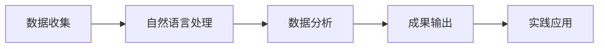
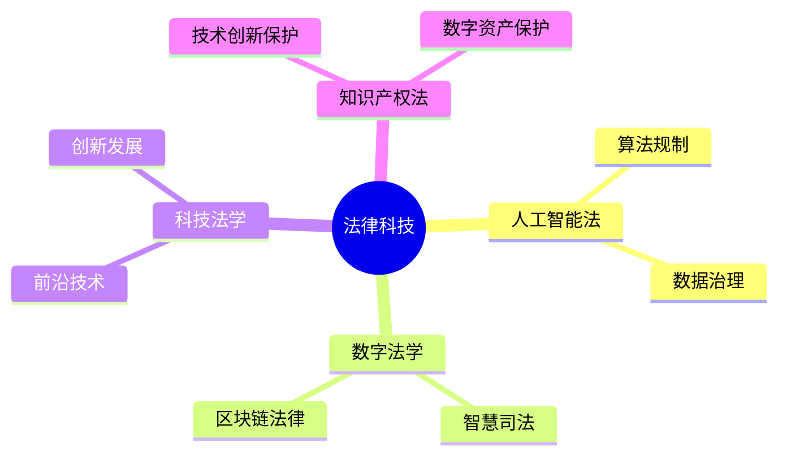

## 👋 关于我

::: info INTJ型法学生
我是一名就读于西安交通大学法学院的法学（复合）专业学生，对法律与科技的交叉领域充满热情。作为一名非典型==INTJ人格==的法学生，我善于将理性思维与创新精神相结合，在法律研究中运用科技手段探索新的可能性。
:::

## 📞 联系方式

- **社交平台**
  - <i class="fab fa-github"></i> GitHub: [SmallsmallQ](https://github.com/SmallsmallQ)
  - <i class="fab fa-bilibili"></i> BiliBili: [我是小Q诶](https://b23.tv/bkcGaXz)

- **即时通讯**
  - <i class="fab fa-qq"></i> QQ: [3517516303](tencent://message/?uin=3517516303)
  - <i class="fab fa-weixin"></i> WeChat: gongyunbo2005

- **电子邮箱**
  - <i class="fas fa-envelope"></i> 学校邮箱: [gongyunbo@stu.xjtu.edu.cn](mailto:gongyunbo@stu.xjtu.edu.cn)

## 📚 教育经历

::: tabs#education

@tab 学业成绩

| 项目 | 成绩 | 说明 |
|:----:|:----:|:----:|
| 综合排名 | 1/30 | 班级排名 |
| 智育排名 | 2/84 | 年级排名 |
| 优秀课程 | 15门90+ | 6门专业第一 |

@tab 语言能力

::: chart 英语水平分析

```echarts
{
  "title": {
    "text": "语言能力分析",
    "textStyle": {
      "fontSize": 16
    }
  },
  "tooltip": {},
  "radar": {
    "indicator": [
      { "name": "CET4", "max": 710 },
      { "name": "CET6", "max": 710 },
      { "name": "口语", "max": 100 },
      { "name": "写作", "max": 100 },
      { "name": "翻译", "max": 100 }
    ],
    "shape": "circle"
  },
  "series": [{
    "name": "语言能力",
    "type": "radar",
    "data": [{
      "value": [635, 566, 85, 90, 88],
      "name": "能力值",
      "areaStyle": {
        "color": "rgba(54, 162, 235, 0.2)"
      },
      "lineStyle": {
        "color": "rgb(54, 162, 235)"
      },
      "itemStyle": {
        "color": "rgb(54, 162, 235)"
      }
    }]
  }]
}
```

:::

@tab 主要荣誉

::: timeline 2023-2024学年
- 国家奖学金获得者
- 体测成绩优秀
- 入党积极分子，党课成绩优秀
:::

:::

## 🏆 学术成果

::: details 科研探索流程

:::

::: warning 重要项目
- 司法大数据视角下校园欺凌研究
- 生成式AI训练数据合理使用研究
- 婚姻关系影响知识产权收益归属研究
:::

## 💼 实践经历

::: tabs#practice

@tab 学生工作

::: details 招团办公室部长工作
- 管理5000+新生群
- 组织招生宣传活动
- 协办高考招生动员大会
- 获评校招生优秀个人
:::

@tab 志愿服务

::: chart 社会实践时长分布

```json
{
  "type": "pie",
  "data": {
    "labels": ["志愿服务", "勤工俭学", "社会实践"],
    "datasets": [{
      "data": [140, 130, 80],
      "backgroundColor": [
        "rgba(255, 99, 132, 0.5)",
        "rgba(54, 162, 235, 0.5)",
        "rgba(255, 206, 86, 0.5)"
      ]
    }]
  }
}
```

:::

:::

## 🔧 技术特长

::: code-tabs

@tab Python
```python
def legal_analysis(text):
    """法律文本分析"""
    return nlp.analyze(text)
```

@tab JavaScript
```javascript
function buildLegalSystem() {
    // 法律科技系统开发
    return legalTechSolution;
}
```

@tab C
```c
struct LegalCase {
    char title[100];
    char type[50];
    int importance;
};
```

:::

## 🌟 个人特色

::: center
### 核心优势
:::

::: tabs#features

@tab 跨界融合
将法律思维与技术创新相结合，探索法律科技的无限可能。

@tab 自主学习
持续关注前沿技术发展，具备强大的自主学习能力。

@tab 团队协作
具备出色的组织管理能力，善于团队协作。

@tab 多元发展
在学术、艺术、科技等多个领域均有建树。

:::

## 📈 未来规划



---

::: center
非典型的法学生，致力于探索法律与科技的创新融合。
:::

::: right
秉持"精勤求学，敦笃励志，果毅力行，忠恕任事"校训，以跨学科视野推动法律科技发展。
:::